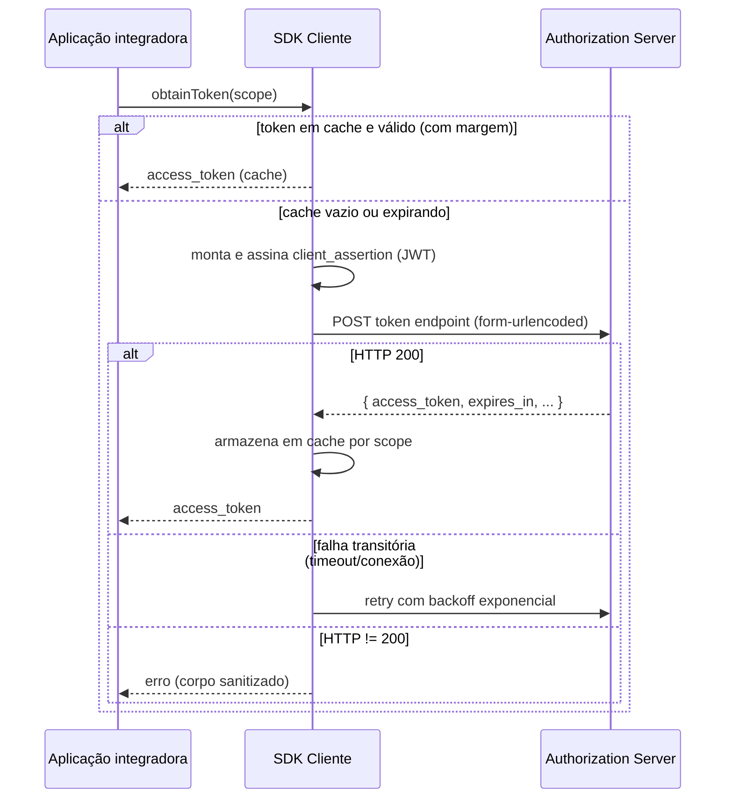

# Especificação de requisitos — Cliente HubSaúde (SDK)

> **Escopo deste documento.** Este é o **contrato comportamental** de um
> SDK cliente do HubSaúde para obtenção de tokens de acesso via
> [SMART Backend Services](https://hl7.org/fhir/smart-app-launch/backend-services.html).
> Os requisitos refletem o comportamento implementado pelo
> `hubsaude-cliente-java` (implementação de referência) e servem de base
> normativa para as quatro implementações oficiais: Java,
> TypeScript/Node.js, C#/.NET e Python. Em caso de divergência aparente
> entre este documento e o [README](README.md), este documento prevalece.

- **Status:** ativo; sincronizado com `hubsaude-cliente-java` 0.3.x.
- **Público-alvo:** desenvolvedores de SDKs do HubSaúde e revisores.
- **Identificadores:** `RF-xx` (funcionais) e `RNF-xx` (não funcionais)
  são locais a este documento; não confundir com os requisitos centrais
  da plataforma HubSaúde.

## 1. Introdução

### 1.1 Objetivo

Um SDK cliente do HubSaúde encapsula, para o sistema integrador:

1. a montagem do JWT `client_assertion` (RFC 7523);
2. sua assinatura digital com a chave privada do cliente;
3. a troca do assertion por um `access_token` no endpoint OAuth 2.0;
4. cache, renovação e resiliência (retry) dessa obtenção;
5. a configuração TLS/mTLS da conexão com o servidor de autorização.

### 1.2 Fora de escopo

Ficam **fora** do escopo do SDK (delegados à camada de orquestração da
aplicação integradora):

- _Circuit breaker_, métricas e _tracing_ (o SDK DEVE apenas expor
  pontos de integração, ex.: instância reutilizável e exceções
  diagnósticas);
- chamadas aos endpoints de dados FHIR (`/fhir/*`) — o SDK entrega o
  token; o uso em `Authorization: Bearer` é responsabilidade do
  integrador;
- gestão do credenciamento (o `client_id` e o registro da chave pública
  são obtidos previamente via Ganesha).

### 1.3 Portfólio oficial de SDKs

O portfólio planejado do HubSaúde é composto pelas quatro implementações
abaixo.

| Ecossistema        | Projeto                   | Papel                                          |
| ------------------ | ------------------------- | ---------------------------------------------- |
| Java               | `hubsaude-cliente-java`   | Implementação de referência                    |
| TypeScript/Node.js | `hubsaude-cliente-js`     | SDK servidor, consumível também por JavaScript |
| C#/.NET            | `hubsaude-cliente-csharp` | SDK para aplicações .NET                       |
| Python             | `hubsaude-cliente-python` | SDK para aplicações e automações Python        |

Todas as implementações DEVEM atender aos requisitos funcionais, não
funcionais e casos de teste deste documento. A implementação Java é a
referência de código, mas não prevalece sobre este contrato; cada SDK DEVE
oferecer uma API idiomática conforme a [seção 9](#9-diretrizes-para-as-implementações-oficiais).

O SDK TypeScript/Node.js DEVE executar somente em ambiente servidor.
Aplicações em navegador ou dispositivos móveis NÃO DEVEM receber
credenciais, certificados ou chaves privadas de SMART Backend Services.

## 2. Convenções

As palavras-chave **DEVE**, **NÃO DEVE**, **DEVERIA**, **PODE** e
**OPCIONAL** seguem o BCP 14 ([RFC 2119](https://datatracker.ietf.org/doc/html/rfc2119)
/ [RFC 8174](https://datatracker.ietf.org/doc/html/rfc8174)).

## 3. Referências normativas

| Referência                                                                                                                     | Descrição                                          |
| ------------------------------------------------------------------------------------------------------------------------------ | -------------------------------------------------- |
| [SMART App Launch — Backend Services](https://hl7.org/fhir/smart-app-launch/backend-services.html)                             | Perfil HL7 para autenticação backend-to-backend    |
| [RFC 6749](https://datatracker.ietf.org/doc/html/rfc6749)                                                                      | OAuth 2.0 (`client_credentials`)                   |
| [RFC 7515](https://datatracker.ietf.org/doc/html/rfc7515)                                                                      | JSON Web Signature (JWS)                           |
| [RFC 7518](https://datatracker.ietf.org/doc/html/rfc7518)                                                                      | JSON Web Algorithms (JWA)                          |
| [RFC 7519](https://datatracker.ietf.org/doc/html/rfc7519)                                                                      | JSON Web Token (JWT)                               |
| [RFC 7521](https://datatracker.ietf.org/doc/html/rfc7521) / [RFC 7523](https://datatracker.ietf.org/doc/html/rfc7523)          | Assertion Framework e JWT profile                  |
| [SMART clinical scopes (STU2)](http://hl7.org/fhir/smart-app-launch/STU2/scopes-and-launch-context.html#clinical-scope-syntax) | Sintaxe dos scopes (`system/Recurso.ações`)        |
| [W3C Trace Context](https://www.w3.org/TR/trace-context/)                                                                      | Header `traceparent` (correlação com a plataforma) |

## 4. Terminologia

| Termo                    | Definição                                                                              |
| ------------------------ | -------------------------------------------------------------------------------------- |
| AS                       | _Authorization Server_ — servidor de autorização do HubSaúde                           |
| `client_id`              | Identificador do cliente, emitido no credenciamento (Ganesha)                          |
| `client_assertion`       | JWT assinado pelo cliente que comprova posse da chave privada                          |
| Token endpoint           | URL `POST` que emite o `access_token` (ex.: `/auth/token`)                             |
| Scope                    | Permissão solicitada, sintaxe SMART (ex.: `system/Patient.rs`)                         |
| Estratégia de assinatura | Abstração da operação de assinar bytes, independente da fonte da chave                 |
| Trust anchor             | Certificado X.509 do servidor confiado explicitamente (substitui o trust store padrão) |
| mTLS                     | TLS mútuo: o cliente apresenta certificado no handshake                                |

## 5. Visão geral do fluxo

## 6. Requisitos funcionais

### 6.1 Autenticação SMART Backend Services

#### RF-01 — Construção do `client_assertion` (JWT)

1. O SDK DEVE construir um JWS compacto (`header.payload.assinatura`),
   com cada parte codificada em **Base64URL sem padding** (RFC 7515).
2. O header DEVE conter os campos `alg` (algoritmo configurado, ver
   [RF-16](#rf-16--algoritmos-de-assinatura)) e `typ` com valor
   `"JWT"`. O campo `kid` é RECOMENDADO e DEVE ser incluído quando o
   parâmetro `keyId` for configurado
   (ver [§8](#8-parâmetros-de-configuração)): o Servidor de
   Autorização seleciona a chave registrada pelo `kid` e o **exige**
   quando o cliente possui múltiplas chaves registradas — `kid`
   ausente nesse caso resulta em `401 invalid_client` (concern
   `client-assertion-contexto-ig.md` §5.1). Com uma única chave
   registrada, a omissão é aceita.
3. O payload DEVE conter as claims:
   - `iss` = `client_id`;
   - `sub` = `client_id`;
   - `aud` = URL do token endpoint efetivo (o mesmo da requisição);
   - `iat` = instante atual (epoch, segundos);
   - `exp` = `iat` + TTL configurado (padrão **60 s**; ver
     [§8](#8-parâmetros-de-configuração));
   - `jti` = identificador único por assertion (UUID aleatório),
     que NÃO DEVE ser reutilizado;
   - `hub_ctx` = objeto `{"ig": "<alias>", "versao": "<semver>"}` com o
     contexto de Guia de Implementação pretendido, quando configurado
     via `hubContext(ig, versao)` (concern
     `client-assertion-contexto-ig.md` §3.4). O `ig` DEVE seguir
     `[a-z][a-z0-9-]{1,30}` e a `versao` DEVE ser SemVer completo
     `MAJOR.MINOR.PATCH` (sem pre-release); valores inválidos DEVEM
     ser rejeitados na configuração. Quando não configurado, o claim
     DEVE ser omitido.
4. O TTL DEVERIA ser ≤ 300 s: o servidor rejeita `exp` superior a
   `iat + 300` (contrato do simulador).
5. A serialização JSON do payload DEVE aplicar _escaping_ correto
   (usar serializador JSON, não concatenação manual de strings).
6. A entrada da assinatura DEVE ser a string ASCII
   `base64url(header) + "." + base64url(payload)` e a saída DEVE ser
   os bytes crus da assinatura, codificados em Base64URL sem padding.
7. Um novo assertion DEVE ser gerado a cada requisição real ao token
   endpoint (nunca reutilizado entre requisições).

#### RF-02 — Requisição de token

1. O SDK DEVE enviar `POST` ao token endpoint com
   `Content-Type: application/x-www-form-urlencoded`.
2. O corpo DEVE conter os parâmetros, todos _percent-encoded_ (UTF-8):
   - `grant_type=client_credentials`;
   - `client_id=<client_id>` — incluído por compatibilidade com
     servidores OAuth2/OIDC (ex.: Keycloak) que o exigem além do
     assertion;
   - `client_assertion_type=urn:ietf:params:oauth:client-assertion-type:jwt-bearer`;
   - `client_assertion=<JWT de RF-01>`;
   - `scope=<scopes separados por espaço>` — DEVE ser **omitido**
     quando nulo, vazio ou somente espaços.
3. A requisição DEVE respeitar os timeouts configurados de conexão e
   de requisição (ver [§8](#8-parâmetros-de-configuração)).
4. Toda requisição HTTP do SDK (token endpoint e descoberta de
   [RF-09](#rf-09--descoberta-via-well-knownsmart-configuration))
   DEVE incluir o header `traceparent`
   ([W3C Trace Context](https://www.w3.org/TR/trace-context/)) no
   formato `00-<trace-id>-<parent-id>-00`:
   - trace-id (16 bytes) e span-id (8 bytes) DEVEM ser gerados por um
     gerador criptograficamente seguro, **por requisição** (cada
     retry usa um par novo), nunca todo-zeros, em hexadecimal
     minúsculo;
   - as _trace-flags_ DEVEM ser `00` (_not sampled_): o SDK não grava
     spans (W3C Trace Context §3.2.2.5.1);
   - o trace-id enviado DEVE constar dos logs de erro/retry e das
     mensagens de erro (`traceId=...`), permitindo correlacionar o
     log do integrador com o `correlation-id` da plataforma — que
     deriva a correlação exclusivamente do contexto de trace W3C.

#### RF-03 — Tratamento da resposta

1. Exclusivamente **HTTP 200** DEVE ser tratado como sucesso.
2. Na resposta de sucesso, o SDK DEVE:
   - extrair `access_token` do JSON; sua ausência DEVE resultar em
     erro (`SmartTokenException` ou equivalente);
   - extrair `expires_in` (segundos); quando ausente, DEVE assumir
     o padrão **3600**;
   - ignorar campos desconhecidos do JSON (tolerância a evolução);
   - disponibilizar ao chamador, além do token, o corpo JSON cru da
     resposta (para inspeção/diagnóstico).
3. **HTTP 429** DEVE resultar em erro imediato, **sem retry
   automático** — a decisão de aguardar e reenviar é do chamador.
   Quando o servidor enviar o header `Retry-After`, seu valor
   DEVERIA ser incluído na mensagem de erro, como diagnóstico.
4. Qualquer outro status ≠ 200 DEVE resultar em erro contendo o
   status HTTP e o corpo da resposta **sanitizado**
   (ver [RNF-02](#rnf-02--sanitização-de-logs-e-mensagens-de-erro)).

### 6.2 Cache e concorrência

#### RF-04 — Cache de tokens por scope

1. O SDK DEVE manter cache de tokens **indexado pelo scope
   normalizado**: string com espaços laterais removidos (_trim_);
   scope nulo equivale à string vazia.
2. O cache DEVE ser habilitado por padrão e desativável por
   configuração.
3. Um token em cache DEVE ser considerado válido somente se
   `agora + margem < instante_de_expiração`, onde
   `instante_de_expiração = instante_da_obtenção + expires_in` e a
   margem é configurável (padrão **30 s**).
4. Quando servido do cache, o resultado DEVE informar o tempo
   restante de validade (mínimo 0); o corpo JSON cru PODE ser nulo
   (não é retido em cache).
5. O token DEVE ser armazenado no cache imediatamente após obtenção
   bem-sucedida.
6. O cache DEVE ter capacidade máxima configurável por quantidade de
   scopes (padrão **1.000**). Ao atingir o teto, a inclusão de um novo
   scope DEVE remover a entrada menos recentemente usada (LRU), sem
   afetar os locks de single-flight.

#### RF-05 — _Single-flight_ por scope

1. Requisições concorrentes pelo **mesmo scope** NÃO DEVEM disparar
   obtenções simultâneas ao AS: apenas uma requisição em voo por
   scope (_single-flight_), as demais aguardam e reutilizam o
   resultado.
2. Após adquirir a exclusão mútua, o SDK DEVE reverificar o cache
   (_double-checked_) antes de ir à rede.
3. A implementação PODE usar _lock striping_ (número fixo de locks,
   scope mapeado por hash) para manter memória O(1) em relação ao
   número de scopes distintos; contenção falsa ocasional entre scopes
   é aceitável, desde que o single-flight por scope seja preservado.

#### RF-06 — Invalidação de cache

1. O SDK DEVE permitir invalidar todo o cache (ex.: após revogação
   externa ou `401` em chamada subsequente aos endpoints de dados).
2. O SDK DEVE permitir invalidar o cache de um scope específico
   (aplicando a mesma normalização de RF-04.1).

### 6.3 Resiliência

#### RF-07 — Retry com backoff exponencial

1. São **falhas transitórias**, elegíveis a retry: timeout de
   conexão, timeout de requisição HTTP e recusa/queda de conexão TCP.
2. NÃO DEVEM sofrer retry automático: respostas HTTP recebidas
   (qualquer status, inclusive 429 e 5xx) e demais erros de I/O.
3. O total de tentativas DEVE ser limitado por `maxRetries`
   (padrão **3**, ou seja, 1 tentativa + até 2 re-tentativas).
4. O atraso antes da tentativa `n+1` DEVE ser
   `1 s × 2^(n−1)` (1 s, 2 s, 4 s, ...), sem _jitter_.
5. Esgotadas as tentativas, o SDK DEVE falhar com erro que informe o
   número de tentativas e preserve a causa original.
6. O cancelamento/interrupção da thread ou tarefa DEVE ser propagado
   (não engolido).

#### RF-08 — Diagnóstico de rejeição de certificado de cliente (mTLS)

1. Quando uma falha de I/O na requisição indicar, heuristicamente,
   que o servidor rejeitou o certificado de cliente após o handshake
   mTLS — falha de handshake TLS, erro de autenticação AEAD
   (_bad tag_) na cadeia de causas, ou alerta `bad_record_mac` — o
   SDK DEVE falhar imediatamente (sem retry) com mensagem
   diagnóstica explicando a causa provável (certificado revogado,
   expirado ou não confiável) e a ação sugerida. Falhas de validação
   do certificado do **servidor** pelo cliente (ex.: `PKIX path
building failed`, certificado do servidor expirado) NÃO DEVEM ser
   atribuídas a rejeição do certificado de cliente.
2. Essa heurística DEVE apenas enriquecer a mensagem de erro; não
   substitui o diagnóstico do servidor.

### 6.4 Descoberta de endpoint

#### RF-09 — Descoberta via `.well-known/smart-configuration`

1. Alternativamente ao token endpoint explícito, o SDK DEVE aceitar
   uma URL base FHIR e resolver o endpoint via
   `GET <base>/.well-known/smart-configuration` (tratando corretamente
   barra final na base).
2. As opções `tokenEndpoint` e `fhirBase` DEVEM ser mutuamente
   exclusivas; exatamente uma DEVE ser informada
   (ver [RF-18](#rf-18--validações-de-configuração)).
3. A descoberta DEVE usar a mesma configuração TLS/mTLS e os mesmos
   timeouts do cliente.
4. Resposta ≠ 200 ou sem o campo `token_endpoint` DEVE resultar em
   erro (com corpo sanitizado).
5. A resolução DEVE ocorrer uma única vez, na construção do cliente;
   o endpoint resolvido DEVE ficar acessível para diagnóstico.

### 6.5 TLS e mTLS

#### RF-10 — Protocolo TLS e confiança no servidor

1. O protocolo TLS DEVE ser configurável; o padrão DEVE ser
   **TLS 1.3**. Protocolo não suportado pela plataforma DEVE resultar
   em erro explícito.
2. Sem trust anchor customizado, o SDK DEVE validar o servidor pelo
   trust store padrão da plataforma (comportamento seguro por padrão,
   incluindo verificação de hostname).
3. O SDK DEVE aceitar um **trust anchor** (certificado X.509, via
   arquivo PEM ou objeto em memória) que substitui o trust store
   padrão — uso previsto: simulador local, homologação com CA
   interna. O anchor DEVE ser validado conforme
   [RF-14](#rf-14--validação-de-certificado).
4. O SDK NÃO DEVE oferecer na API pública modo "confiar em tudo"
   (_trust-all_); tal modo, se existir, DEVE ser restrito a código de
   teste.

#### RF-11 — mTLS (TLS mútuo)

1. Quando houver chave privada e certificado do cliente disponíveis,
   o SDK DEVE configurar a conexão para **apresentar o certificado de
   cliente** se o servidor o solicitar no handshake.
2. Quando o servidor não solicitar certificado, a conexão DEVE se
   comportar como TLS unidirecional (retrocompatível).
3. O material de mTLS DEVE poder vir de: chave+certificado em memória
   (carregados de PEM) ou _keystore_ da plataforma
   (ex.: PKCS#12/JKS/PKCS#11 em Java), permitindo que a chave nunca
   saia de dispositivo criptográfico.
4. Na ausência de material de cliente, o SDK DEVE operar com TLS
   unidirecional, sem erro.

### 6.6 Material criptográfico

#### RF-12 — Fontes de chave (estratégia de assinatura)

1. O SDK DEVE abstrair a assinatura em uma **estratégia** com um
   único contrato: `sign(bytes) -> bytes` (assinatura crua, não
   codificada), lançando erro específico de assinatura em falha
   criptográfica.
2. O SDK DEVE suportar as fontes:
   - chave privada já carregada em memória (ex.: obtida de cofre —
     OpenBao/Vault, Secret Manager);
   - arquivo PEM, com e sem senha;
   - conteúdo PEM em string (ex.: variável de ambiente/secret);
   - _keystore_ PKCS#12/JKS (chave referenciada por alias e senha);
   - HSM/token via PKCS#11 (a chave NÃO DEVE sair do hardware; a
     assinatura é delegada ao dispositivo).
3. Chave não encontrada (alias inexistente) ou PIN/senha inválidos
   DEVEM resultar em erro explícito.
4. A estratégia DEVE ser thread-safe (em Java, uma instância nova de
   `Signature` por chamada; equivalente em outras plataformas).

#### RF-13 — Formatos de chave PEM

1. O SDK DEVE aceitar, com detecção automática de formato:
   - PKCS#8 não criptografado (`BEGIN PRIVATE KEY`);
   - PKCS#1 RSA (`BEGIN RSA PRIVATE KEY`);
   - PKCS#8 criptografado (`BEGIN ENCRYPTED PRIVATE KEY`);
   - OpenSSL tradicional criptografado (`DEK-Info`).
2. Chave criptografada sem senha fornecida DEVE resultar em erro
   indicando a necessidade de senha; senha incorreta DEVE resultar em
   erro indicando a causa provável.
3. Arquivo vazio, ilegível ou de formato não suportado DEVE resultar
   em erro que identifique a fonte (caminho ou `<string>`).

#### RF-14 — Validação de certificado

1. Certificados X.509 fornecidos (do cliente ou trust anchor) DEVEM
   ser validados na carga (_fail-fast_): parse X.509 bem-sucedido e
   período de validade corrente (`not before`/`not after`).
2. Certificado expirado, ainda não válido ou arquivo que não contém
   certificado X.509 DEVEM resultar em erro que identifique o
   arquivo e a condição.

#### RF-15 — Consistência chave–certificado

1. Quando chave privada e certificado do cliente forem fornecidos
   como objetos diretos (sem estratégia explícita), o SDK DEVE
   verificar na construção que formam um par: assinar um desafio
   fixo com a chave e verificar com a chave pública do certificado.
2. A verificação DEVE suportar ao menos chaves RSA e EC; tipos não
   suportados DEVEM resultar em erro explícito.
3. Falha na verificação DEVE impedir a construção do cliente, com
   mensagem que aponte a inconsistência (arquivos trocados, chave
   corrompida, certificado regenerado).

#### RF-16 — Algoritmos de assinatura

1. O algoritmo JWT (`alg`) DEVE ser configurável; o padrão DEVE ser
   **RS384** — o Servidor de Autorização do HubSaúde aceita apenas
   `RS384` e `ES384` (concern `client-assertion-contexto-ig.md` §3.2).
2. O SDK DEVE suportar, no mínimo: `RS256`, `RS384`, `RS512`
   (RSA PKCS#1 v1.5), `PS256`, `PS384`, `PS512` (RSA-PSS) e
   `ES256`, `ES384`, `ES512` (ECDSA). Valor não reconhecido DEVE
   resultar em erro que liste os válidos (comparação
   case-insensitive).
3. O algoritmo configurado DEVE determinar simultaneamente o valor do
   header `alg` e o algoritmo criptográfico da estratégia criada a
   partir de chave/PEM. Quando a estratégia é fornecida pronta pelo
   integrador, o SDK PODE usar o `alg` apenas no header — a
   compatibilidade entre estratégia e `alg` é responsabilidade do
   integrador e DEVE estar documentada.
4. Para `ES*`, a assinatura JWS DEVE estar no formato bruto
   `R || S` (RFC 7518 §3.4). Plataformas cuja API produz DER/ASN.1
   DEVEM converter (ver [§9.3](#93-assinaturas-ecdsa-es-formato-jose)).

### 6.7 API pública

#### RF-17 — Operações mínimas

O SDK DEVE expor, com nomes idiomáticos da linguagem
(ver [§9.1](#91-mapeamento-de-nomes)):

| Operação                                      | Comportamento                                                     |
| --------------------------------------------- | ----------------------------------------------------------------- |
| `obtainToken(scope) -> string`                | Token de acesso (cache + retry transparentes)                     |
| `obtainTokenResponse(scope) -> TokenResponse` | Mesmo fluxo, retornando `{accessToken, expiresIn, rawJson?}`      |
| `invalidateCache()`                           | Limpa todo o cache                                                |
| `invalidateCache(scope)`                      | Limpa o cache do scope                                            |
| `getTokenEndpoint() -> string`                | Endpoint efetivo (inclusive descoberto)                           |
| `getJwtAlgorithm() -> string`                 | Algoritmo `alg` configurado                                       |
| `builder()` / construção fluente              | Configuração legível e validada                                   |
| `close()` / `dispose()`                       | Libera recursos internos e invalida o cache; operação idempotente |

`obtainToken` DEVE delegar a `obtainTokenResponse` (mesma semântica
de cache, single-flight e resiliência).

Quando a plataforma possuir recursos explícitos de I/O, a operação de
fechamento DEVE seguir o idioma da linguagem (`AutoCloseable` no Java,
`IDisposable` no .NET ou equivalente). Após o fechamento, novas
operações de token DEVEM falhar explicitamente.

#### RF-18 — Validações de configuração

Na construção, o SDK DEVE aplicar as seguintes validações:

1. falhar com erro explícito quando `tokenEndpoint` e `fhirBase` forem
   ambos definidos, ou nenhum;
2. falhar com erro explícito quando `clientId` estiver ausente;
3. falhar com erro explícito quando estratégia de assinatura e chave PEM
   forem ambas definidas, ou nenhuma;
4. substituir pelos padrões os valores não positivos de TTL do
   assertion, `maxRetries` ou margem do cache (comportamento tolerante);
5. falhar com erro explícito quando `tokenCacheMaxEntries` for menor ou
   igual a zero;
6. falhar com erro explícito quando timeouts nulos forem informados.

O certificado do cliente DEVE ser opcional quando a estratégia de
assinatura é fornecida diretamente (sem certificado não há mTLS).

#### RF-19 — Modelo de erros

1. O SDK DEVE definir ao menos dois tipos de erro:
   - **erro de token** (`SmartTokenException` ou equivalente):
     configuração inválida de material criptográfico, respostas
     inesperadas do AS, JSON inválido, algoritmo não suportado;
   - **erro de assinatura** (`SigningException` ou equivalente):
     falha criptográfica na estratégia de assinatura.
2. Erros DEVEM preservar a causa original (exceção encadeada) e
   conter mensagens em pt-BR acionáveis (o que falhou; causa
   provável; próxima ação), sem expor segredos.
3. Erros de I/O de rede PODEM ser expostos como os erros nativos da
   plataforma (em Java, `IOException`).

## 7. Requisitos não funcionais

#### RNF-01 — Thread-safety e ciclo de vida

A instância do cliente DEVE ser thread-safe (ou _task-safe_ no modelo
assíncrono da plataforma) e reutilizável pelo ciclo de vida da
aplicação; a documentação DEVE recomendar instância única e fechamento
explícito no encerramento. O fechamento DEVE ser idempotente, aguardar
operações em voo e invalidar o cache antes de liberar os recursos.

#### RNF-02 — Sanitização de logs e mensagens de erro

1. Tokens, chaves privadas e senhas NÃO DEVEM aparecer em logs nem em
   mensagens de exceção.
2. Corpos de resposta incluídos em erros DEVEM ser sanitizados:
   valores de `access_token`/`token` (em JSON e em
   `form-urlencoded`) substituídos por `[REDACTED]` e o corpo
   limitado a 500 caracteres.
3. Logs DEVEM usar a infraestrutura padrão da plataforma (em Java,
   SLF4J; sem `print`), em níveis: `debug` (cache, construção),
   `info` (token obtido, cache invalidado), `warn` (retries, 429),
   `error` (falhas definitivas).

#### RNF-03 — Higiene de segredos em memória

Senhas e PINs DEVEM ser recebidos em estruturas mutáveis da
plataforma (em Java, `char[]`) e limpos (zerados) após o uso, quando
a plataforma permitir.

#### RNF-04 — Dependências mínimas

O SDK DEVERIA usar primordialmente a biblioteca padrão da plataforma
(HTTP, JSON, criptografia), admitindo dependências pontuais apenas
para lacunas reais (em Java: BouncyCastle para parsing PEM; Jackson
para JSON). NÃO DEVE depender de frameworks de aplicação.

#### RNF-05 — Desempenho

Com cache habilitado, chamadas repetidas por scope DEVEM ser servidas
sem I/O de rede enquanto o token for válido; a estrutura de locks
DEVE ter memória constante (RF-05.3).

#### RNF-06 — Testes e cobertura

1. O SDK DEVE ter testes automatizados independentes de serviços externos.
   Testes ponta a ponta contra ambientes externos PODEM complementar o gate,
   mas NÃO DEVEM ser necessários para compilar e validar o projeto.
2. Cobertura mínima de linha: **85%**, aplicada como _gate_ no
   release (referência Java: JaCoCo).
3. Os casos mínimos de conformidade de [§11](#11-casos-de-teste-mínimos-de-conformidade)
   DEVEM estar cobertos.

#### RNF-07 — Documentação

API pública documentada no formato da plataforma (Javadoc, docstring,
JSDoc/TSDoc, XML doc comments), em pt-BR, incluindo exemplos de uso
por fonte de chave e a recomendação de circuit breaker externo.

#### RNF-08 — Licença, versionamento e release

Apache 2.0; SemVer; publicação disparada por tag
(padrão do monorepo: `cliente-<linguagem>-vMAJOR.MINOR.PATCH`,
ADR-33/ADR-36); artefato acompanhado de SBOM quando o ecossistema
suportar (referência Java: CycloneDX).

## 8. Parâmetros de configuração

| Parâmetro                        | Obrigatório | Padrão                    | Observações                                              |
| -------------------------------- | ----------- | ------------------------- | -------------------------------------------------------- |
| `tokenEndpoint`                  | sim¹        | —                         | URL completa do endpoint de token                        |
| `fhirBase`                       | sim¹        | —                         | Base FHIR para descoberta (RF-09)                        |
| `clientId`                       | sim         | —                         | Emitido pelo Ganesha                                     |
| `privateKeyPem`                  | sim²        | —                         | Caminho do PEM da chave privada                          |
| `privateKeyPassword`             | não         | —                         | Senha do PEM criptografado                               |
| `signingStrategy`                | sim²        | —                         | Estratégia pronta (HSM, cofre etc.)                      |
| `certificatePem`                 | não³        | —                         | Certificado do cliente (PEM)                             |
| `clientKeyStore` (+alias, senha) | não         | —                         | mTLS via keystore (PKCS#11/12, JKS)                      |
| `serverTrustAnchor`              | não         | trust store da plataforma | PEM ou objeto X.509                                      |
| `tlsProtocol`                    | não         | `TLSv1.3`                 | Ex.: `TLSv1.2`                                           |
| `jwtAlgorithm`                   | não         | `RS384`                   | Ver RF-16                                                |
| `keyId`                          | não         | —                         | Inclui `kid` no header do JWT quando informado (RF-01.2) |
| `hubContext` (ig, versao)        | não         | —                         | Inclui o claim `hub_ctx` no assertion (RF-01.3)          |
| `connectTimeout`                 | não         | 10 s                      | Conexão TCP                                              |
| `requestTimeout`                 | não         | 30 s                      | Requisição HTTP completa                                 |
| `assertionTtlSeconds`            | não         | 60                        | ≤ 0 → padrão; DEVERIA ser ≤ 300                          |
| `maxRetries`                     | não         | 3                         | Tentativas totais; ≤ 0 → padrão                          |
| `enableTokenCache`               | não         | `true`                    |                                                          |
| `tokenCacheMarginSeconds`        | não         | 30                        | ≤ 0 → padrão                                             |
| `tokenCacheMaxEntries`           | não         | 1.000                     | Deve ser positivo; descarte LRU por scope                |

¹ Exatamente um entre `tokenEndpoint` e `fhirBase`.
² Exatamente um entre `privateKeyPem` e `signingStrategy`.
³ Obrigatório apenas para mTLS via chave em memória e para a
verificação RF-15.

## 9. Diretrizes para as implementações oficiais

Esta seção é **informativa**: registra decisões idiomáticas
recomendadas para manter paridade comportamental.

### 9.1 Mapeamento de nomes

| Conceito          | Java (referência)                         | Python                                  | TypeScript/Node.js                                     | C#/.NET                                   |
| ----------------- | ----------------------------------------- | --------------------------------------- | ------------------------------------------------------ | ----------------------------------------- |
| Cliente           | `SmartTokenClient`                        | `SmartTokenClient`                      | `SmartTokenClient`                                     | `SmartTokenClient`                        |
| Obtenção          | `obtainToken(scope)`                      | `obtain_token(scope)`                   | `obtainToken(scope)` (async)                           | `ObtainTokenAsync(scope)`                 |
| Resposta completa | `obtainTokenResponse`                     | `obtain_token_response`                 | `obtainTokenResponse`                                  | `ObtainTokenResponseAsync`                |
| Construção        | `builder()` fluente                       | kwargs no construtor                    | `createSmartTokenClient(options)` (fábrica assíncrona) | _options object_ / builder                |
| Estratégia        | `SigningStrategy` (interface funcional)   | `Callable[[bytes], bytes]` ou protocolo | `(data: Uint8Array) => Uint8Array \| Promise<...>`     | `Func<byte[], byte[]>` ou interface       |
| Erros             | `SmartTokenException`, `SigningException` | `SmartTokenError`, `SigningError`       | `SmartTokenError`, `SigningError`                      | `SmartTokenException`, `SigningException` |

Na implementação Java, `SmartTokenClient` não expõe construtores
públicos. O builder é a única entrada suportada para construção e
centraliza validações, defaults e resolução dos materiais criptográficos.

Na implementação TypeScript/Node.js, `createSmartTokenClient` é
igualmente a única entrada suportada: `SmartTokenClient` não expõe
construtor público (aplicado tanto em tempo de compilação quanto em
runtime), pelo mesmo motivo — centralizar validação, defaults e
resolução dos materiais criptográficos num único ponto de entrada.

### 9.2 Criptografia e HTTP por plataforma

| Capacidade           | Python                                    | TypeScript/Node.js                                       | C#/.NET                                         |
| -------------------- | ----------------------------------------- | -------------------------------------------------------- | ----------------------------------------------- |
| Assinatura RSA/ECDSA | `cryptography` (hazmat)                   | `node:crypto` (`crypto.sign`)                            | `System.Security.Cryptography` (`RSA`, `ECDsa`) |
| PEM (com senha)      | `load_pem_private_key(..., password=...)` | `crypto.createPrivateKey({ key, passphrase })`           | `ImportFromEncryptedPem` / `PemEncoding`        |
| PKCS#12              | `serialization.pkcs12`                    | decodificação em memória via lib dedicada (`node-forge`) | `X509Certificate2(Load)`                        |
| PKCS#11 (HSM)        | `python-pkcs11`                           | `pkcs11js` (_peer dependency_ opcional)                  | `Pkcs11Interop`                                 |
| HTTP + TLS custom    | `httpx`/`ssl.SSLContext`                  | `node:http`/`node:https` nativos (`https.Agent`)         | `HttpClient` + `SocketsHttpHandler.SslOptions`  |
| mTLS                 | `SSLContext.load_cert_chain`              | material de cliente no `https.Agent`                     | `SslOptions.ClientCertificates`                 |

### 9.3 Assinaturas ECDSA (`ES*`): formato JOSE

APIs criptográficas divergem no formato de saída ECDSA:

- **.NET**: usar `DSASignatureFormat.IeeeP1363FixedFieldConcatenation`
  (já produz `R||S`);
- **Node**: usar `dsaEncoding: 'ieee-p1363'` em `crypto.sign`;
- **Python** (`cryptography`): a saída é DER — converter com
  `decode_dss_signature` e concatenar `R||S` com tamanho fixo;
- **Java**: `SHA256withECDSA` produz DER; a implementação de
  referência usa as variantes `...inP1363Format` do JDK, que já
  produzem `R||S` (RF-16.4).

### 9.4 Concorrência e modelo assíncrono

- O comportamento de RF-04/RF-05 (cache + single-flight +
  double-check) é normativo; o mecanismo é idiomático:
  - **Python**: `threading.Lock`/`asyncio.Lock` por stripe;
  - **Node**: _event loop_ único — deduplicar com
    `Map<scope, Promise>` (a promessa em voo é o single-flight);
  - **C#**: `SemaphoreSlim` por stripe, `async/await`
    (`ConfigureAwait(false)` em biblioteca).
- Linguagens de I/O assíncrono DEVERIAM expor a API como assíncrona
  (`async`/`await`), mantendo a semântica dos requisitos.
- O backoff (RF-07) DEVE usar espera não bloqueante quando o modelo
  da plataforma for assíncrono.

## 10. Rastreabilidade — requisito → implementação de referência

| Requisito | Java (`br.gov.go.saude.hubsaude.client`)                                     |
| --------- | ---------------------------------------------------------------------------- |
| RF-01     | `SmartTokenClient.buildClientAssertion()`                                    |
| RF-02     | `SmartTokenClient.buildFormBody()`, `doObtainToken()`, `TraceContext`        |
| RF-03     | `SmartTokenClient.doObtainToken()`, `parseTokenResponse()`                   |
| RF-04     | `SmartTokenClient.tokenCache`, `CachedToken.isValid()`                       |
| RF-05     | `SmartTokenClient.scopeLockFor()` (32 stripes), `obtainTokenResponse()`      |
| RF-06     | `SmartTokenClient.invalidateCache()` (2 sobrecargas)                         |
| RF-07     | `SmartTokenClient.obtainTokenResponse()` (laço de tentativas), `RetryPolicy` |
| RF-08     | `SmartTokenClient.isLikelyClientCertificateRejection()`                      |
| RF-09     | `SmartTokenClientBuilder.discoverTokenEndpoint()`                            |
| RF-10     | `SslContextFactory.buildSslContext(...)`                                     |
| RF-11     | `SslContextFactory.buildKeyManagers(...)`                                    |
| RF-12     | `SigningStrategy`, `SigningStrategyFactory`, `PrivateKeySigningStrategy`     |
| RF-13     | `PemLoader.loadPrivateKey*`                                                  |
| RF-14     | `SslContextFactory.validateCertificate(...)`                                 |
| RF-15     | `SmartTokenClient.verifyKeyPairConsistency()`                                |
| RF-16     | `SigningStrategyFactory.jwtAlgorithmToJava()`                                |
| RF-17     | `SmartTokenClient` (API pública), `TokenResponse`                            |
| RF-18     | `SmartTokenClientBuilder.build()`, `FaultToleranceConfig`                    |
| RF-19     | `SmartTokenException`, `SigningException`                                    |
| RNF-02    | `SmartTokenClient.sanitizeErrorResponse()`                                   |
| RNF-03    | `PemLoader.clearPassword()`                                                  |

> Esta tabela rastreia requisito → **implementação de referência**
> (Java), não a implementação TypeScript/Node.js deste repositório. O
> rastreamento requisito → implementação TS é mantido separadamente,
> como material interno de desenvolvimento deste projeto.

## 11. Casos de teste mínimos de conformidade

Uma implementação DEVE cobrir, no mínimo:

1. **JWT**: estrutura em 3 partes Base64URL sem padding; claims
   `iss=sub=client_id`, `aud=endpoint`, `exp−iat=TTL`, `jti` único
   entre duas gerações; header sem `kid` quando `keyId` não é
   configurado e com `kid` quando é (RF-01.2).
2. **Form body**: parâmetros obrigatórios presentes e
   percent-encoded; `scope` omitido quando vazio/nulo.
3. **Resposta**: sucesso 200; erro sem `access_token`;
   `expires_in` ausente → 3600; campos desconhecidos ignorados.
4. **Erros HTTP**: 429 sem retry; 400/401/500 com corpo sanitizado
   (token redigido, limite de 500 caracteres).
5. **Cache**: hit dentro da validade; miss após expirar a margem;
   scopes distintos independentes; normalização (trim/nulo);
   invalidação total e por scope; cache desabilitado → sempre rede.
6. **Single-flight**: N chamadas concorrentes do mesmo scope → 1
   requisição ao AS.
7. **Retry**: timeouts/conexão recusada com backoff 1s/2s/...;
   esgotamento após `maxRetries`; sucesso na 2ª tentativa.
8. **mTLS**: heurística de rejeição de certificado (RF-08) gera erro
   diagnóstico imediato.
9. **Descoberta**: sucesso; resposta sem `token_endpoint`; status
   ≠ 200; base com e sem barra final.
10. **PEM**: 4 formatos de RF-13; senha ausente/incorreta;
    arquivo vazio/inválido.
11. **Certificado**: expirado, ainda não válido, arquivo sem X.509.
12. **Par chave–certificado**: par válido; par inconsistente falha
    na construção.
13. **Algoritmos**: mapeamento dos 9 valores de RF-16; valor inválido
    rejeitado; case-insensitive.
14. **Validações de construção**: cada regra de RF-18.
15. **Integração**: fluxo completo de obtenção de token e TLS com trust
    anchor em ambiente de teste, executado fora do gate público quando exigir
    infraestrutura externa.

## 12. Evolução prevista

Evoluções futuras PODEM alterar este contrato conforme Versionamento
Semântico, incluindo _jitter_ no backoff e robustez adicional das claims JWT
(item 10), observabilidade opcional (item 12) e política formal de
compatibilidade de API (item 7).
